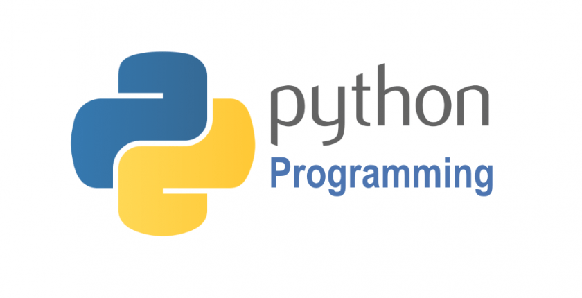

# Python 速览



本手册中的许多例子，甚至交互式命令都包含注释。Python 注释以 # 开头，直到该物理行结束。注释可以在行开头，或空白符与代码之后，但不能在字符串里面。字符串中的井号就是井号。注释用于阐明代码，Python 不解释注释，键入例子时，可以不输入注释。

```python
# this is the first comment
spam = 1  # and this is the second comment
          # ... and now a third!
text = "# This is not a comment because it's inside quotes."
```

## Python 用作计算器

现在，尝试一些简单的 Python 命令。启动解释器，等待主提示符（>>> ）出现。

- 数字
- 字符串
- 列表

### 数字

解释器像一个简单的计算器：输入表达式，就会给出答案。表达式的语法很直接：运算符 +、-、*、/ 的用法和其他大部分语言一样（比如，Pascal 或 C）；括号 (()) 用来分组。例如：

```python
>>> 2 + 2
4
>>> 50 - 5*6
20
>>> (50 - 5*6) / 4
5.0
>>> 8 / 5  # division always returns a floating point number
1.6
```

### 字符串

除了数字，Python 还可以操作字符串。字符串有多种表现形式，用单引号（'……'）或双引号（"……"）标注的结果相同 2。反斜杠 \ 用于转义：

```python
>>> 'spam eggs'  # single quotes
'spam eggs'
>>> 'doesn\'t'  # use \' to escape the single quote...
"doesn't"
>>> "doesn't"  # ...or use double quotes instead
"doesn't"
>>> '"Yes," they said.'
'"Yes," they said.'
>>> "\"Yes,\" they said."
'"Yes," they said.'
>>> '"Isn\'t," they said.'
'"Isn\'t," they said.'
```

### 列表
Python 支持多种 复合 数据类型，可将不同值组合在一起。最常用的 列表 ，是用方括号标注，逗号分隔的一组值。列表 可以包含不同类型的元素，但一般情况下，各个元素的类型相同：

```python
>>> squares = [1, 4, 9, 16, 25]
>>> squares
[1, 4, 9, 16, 25]
```

## 流程控制工具
当然，Python 还可以完成比二加二更复杂的任务。 例如，可以编写斐波那契数列的初始子序列。

1. 循环
1. if 语句
1. for 语句

### 循环

循环体是缩进的 ：缩进是 Python 组织语句的方式。在交互式命令行里，得为每个缩输入制表符或空格。使用文本编辑器可以实现更复杂的输入方式；所有像样的文本编辑器都支持自动缩进。交互式输入复合语句时, 要在最后输入空白行表示结束（因为解析器不知道哪一行代码是最后一行）。注意，同一块语句的每一行的缩进相同。

```python
>>> # Fibonacci series:
... # the sum of two elements defines the next
... a, b = 0, 1
>>> while a < 10:
...     print(a)
...     a, b = b, a+b
...
0
1
1
2
3
5
8
```

### if 语句

最让人耳熟能详的应该是 if 语句。例如：

```python
x = int(input("Please enter an integer: "))
if x < 0:
    x = 0
    print('Negative changed to zero')
elif x == 0:
    print('Zero')
elif x == 1:
    print('Single')
else:
    print('More')

```

### for 语句

Python的```for```语句与C或Pascal中的不同。Python 的```for```语句不迭代算术递增数值（如 Pascal），或是给予用户定义迭代步骤和暂停条件的能力（如 C），而是迭代列表或字符串等任意序列，元素的迭代顺序与在序列中出现的顺序一致。 例如：

```python
# Strategy:  Iterate over a copy
for user, status in users.copy().items():
    if status == 'inactive':
        del users[user]

# Strategy:  Create a new collection
active_users = {}
for user, status in users.items():
    if status == 'active':
        active_users[user] = status
```