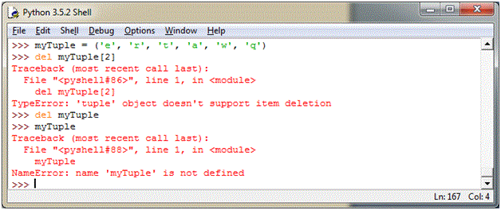

# 数据结构

## 列表详解

### 用列表实现堆栈
使用列表方法实现堆栈非常容易，最后插入的最先取出（“后进先出”）。把元素添加到堆栈的顶端，使用 append() 。从堆栈顶部取出元素，使用 pop() ，不用指定索引。

### 用列表实现队列
列表也可以用作队列，最先加入的元素，最先取出（“先进先出”）；然而，列表作为队列的效率很低。因为，在列表末尾添加和删除元素非常快，但在列表开头插入或移除元素却很慢（因为所有其他元素都必须移动一位）。

实现队列最好用 collections.deque，可以快速从两端添加或删除元素。

## del 语句
del 语句按索引，而不是值从列表中移除元素。与返回值的 pop() 方法不同， del 语句也可以从列表中移除切片，或清空整个列表（之前是将空列表赋值给切片）

## 数学公式

内置公式：$E=MC^2$

 $$
  \int_0^\infty \frac{x^3}{e^x-1} dx = \frac{\pi^4}{15}
 $$
